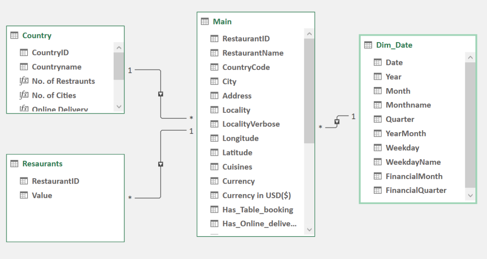
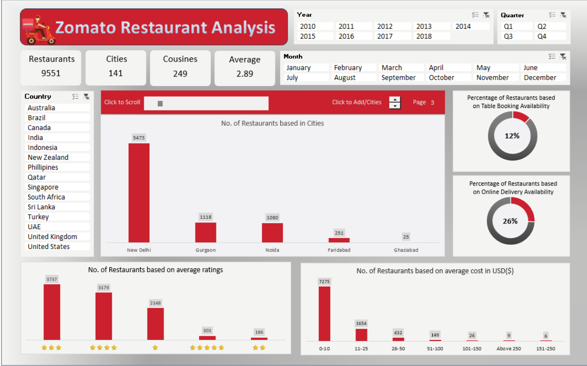

# Excel
To achieve the objectives of the Zomato Restaurant Data Analysis project, various advanced Excel functions were used, including:

#### Functions : VLOOKUP and SWITCH functions played a crucial role in generating custom columns tailored to project specifications.
#### Power Query Editor : Power Query Editor was used to streamline data processing, encompassing data cleaning and transformation, and enable the creation of a cuisine count table.
#### Data Model snapshot :

 

#### Power Pivot : Power Pivot was used to define relationships between tables, supporting the development of interactive and customizable PivotCharts.
## Dashboard snapshot :

 
