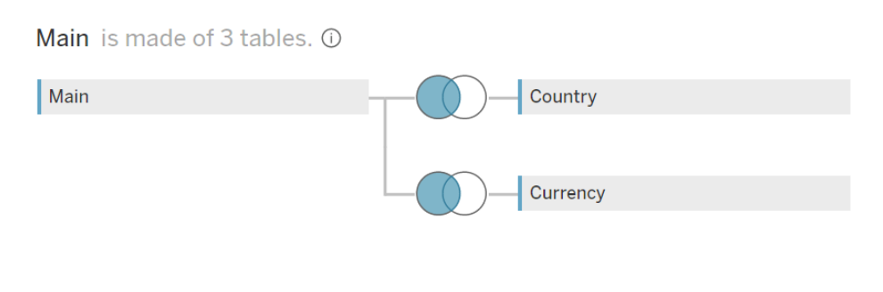

# Tableau
To achieve the objectives of the Zomato Restaurant Data Analysis project, Calculated fields were used to create columns for visualisation. We had to Create unions between 2 tables to the main table.

### Union snapshot :

 
